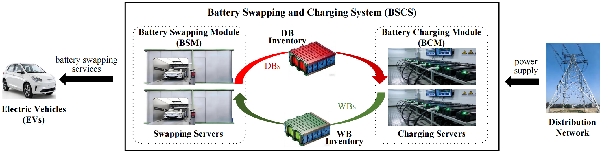

# PriBSCS Reproducibility Package

[English](README.md) | [中文](README_zh.md)

This repository contains the core scripts, result tables, and figure outputs for reproducing the PriBSCS paper experiments.

## Project Overview

The system model is shown below.



## Contents

- `run.py`: runs the main PriBSCS simulations and exports result CSV files.
- `sensitivity.py`: runs the ADMM penalty sensitivity study and exports Table-style CSV output.
- `plot.py`: generates paper-aligned figures from `data_results/`.
- `data_results/`: generated result data used for plots and reported metrics.
- `figures/`: generated figure files.
- `requirements.txt`: Python dependencies.

## Quick Start

```bash
python3 -m venv .venv
source .venv/bin/activate
pip install -r requirements.txt
python run.py
python sensitivity.py
python plot.py
```

## Notes

- The code uses CVXPY with solver fallback where available.
- `gurobipy` requires a valid Gurobi installation and license.
- If some CSV files are missing, run `run.py` first and then run `plot.py`.

## Citation

If this codebase is useful in your research, citing the following paper is appreciated:

```bibtex
@article{chi2026pribscs,
  title={PriBSCS: privacy-preserving distributed coordination for battery swapping and charging systems},
  author={Chi, Haotian and Zuo, Fei and Sun, Zhuocheng and Geng, Haijun and Wang, Yuwei and Jiang, Shunrong},
  journal={Journal of King Saud University Computer and Information Sciences},
  year={2026},
  volume={38},
  number={6},
  pages={338--338},
  doi={10.1007/s44443-026-00761-z}
}
```
